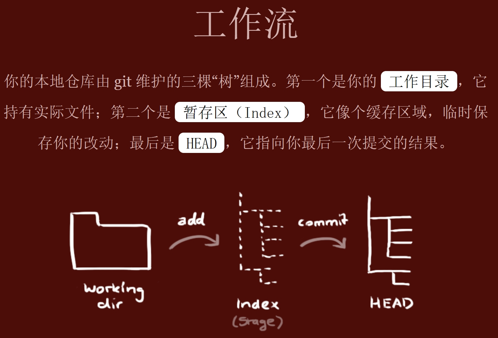

## git

配置:

- `git config [--global]`: global配置全局, 无global配置当前仓库
- `git config --global user.name ''`: 配置全局用户名
- `git config --global user.email ''`: 配置全局邮箱
- `git config --global format.pretty oneline`: 使log单行显示
- `git config <-e|--edit>`: 编辑当前仓库的配置文件
- `git config <-e|--edit> --global`: 针对所有仓库

工作流:

创建仓库:

- `git init`: 初始化仓库

- `git clone`: 克隆远程仓库

  - git clone /path/to/repository: 创建一个本地仓库的克隆版本
  
  - git clone username@host:/path/to/repository: 克隆远端服务器上的仓库

提交与更改:

- `git status [-s|--short]`: 查看状态

- `git add <[file]|[dir]>`: 添加工作区的文件或更改到暂存区

- `git commit -m [message]`: 将暂存区内容添加到版本库

- git reset: 版本回退

  - `git reset [--mixed] <commit>`: 重置HEAD到指定提交,并重置暂存区,但不会修改工作树[默认行为]

  - `git reset --soft <commit>`: 重置HEAD到指定提交, 不更改工作树和暂存区

  - `git reset --hard <commit>`: 重置HEAD到指定提交, 并重置工作树和暂存区

- git diff: 比较文件不同

  - `git diff [file|dir]`: 比较当前工作区与暂存区的差异

  - `git diff --staged/cached [file|dir]`: 比较暂存区和最新一次提交的差异

  - `git diff <commidId>`: 比较工作区与commidId的差异

  - `git diff <commidId1> <commidId2>`: 比较2次提交之间的差异

  - `git diff --stat ...`: 显示摘要而非整个diff 

- git restore: 恢复或撤销文件的更改

  - `git restore [--worktree] <file>`: 恢复工作树中与暂存区不匹配的文件(不考虑已经在暂存区中的更改)到最新的更改

  - `git restore --staged <file>`: 撤销暂存区的更改, 但保留工作树中的更改

  - `git restore --source=<commit> <file>`: 还原文件到指定提交的状态

- git rm: 从工作树和索引中移除文件, 相当于`rm + git add .`

  - `git rm`: 删除出工作树和索引的文件,并将这次删除添加到暂存区(删除的文件必须是已跟踪但未更改的,也就是当前版本库中的文件)

  - `git rm -f`: 强制删除, 可以删除更改过的文件

  - `git rm --cached`: 只删除暂存区(索引)中的文件, 已跟踪的文件会变成未跟踪保留下来

- git mv: 移动或重命名, 相当于`mv + git add .`

- git checkout: 分支切换

  - `git checkout <branch-name>`: 切换到指定分支

  - `git checkout -b <branch-name>`: 创建分支并切换

  - `git checkout -d <branch-name>`: 删除分支

  - `git checkout -`: 快速切换到上一个分支

  - `git checkout -- <file>`: 恢复工作区到最近一次提交, 不修改暂存区

  - `git checkout tags/<tag-name>`: 切换到标签指向的提交状态

  - `git branch`: 查看可用分支和标签

日志: 查看历史提交记录

- `git log [--oneline]`: 查看提交日志

- `git show <commidId>`: 显示提交的详细信息

- `git blame [options] <filepath>`: 逐行显示文件每行内容是什么时候引入或修改的

